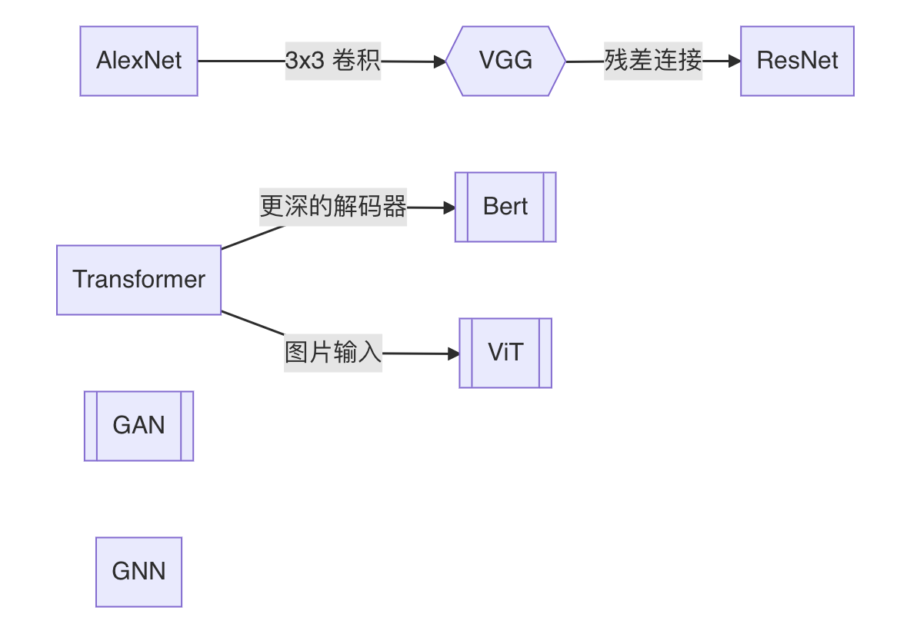

# 深度学习论文精读

## 录制完成的论文

| 日期 | 标题 | 封面 | 时长 | 视频（4K） |
| -- | -- | -- | -- | -- |
| 11/18/21 | [BERT](https://arxiv.org/abs/1810.04805) 逐段精读 |  | 45:49  | [B站](https://www.bilibili.com/video/BV1PL411M7eQ), [知乎](https://www.zhihu.com/zvideo/1445340200976785408), [YouTube](https://youtu.be/ULD3uIb2MHQ) |
| 11/9/21 | [GAN](https://papers.nips.cc/paper/2014/file/5ca3e9b122f61f8f06494c97b1afccf3-Paper.pdf) 逐段精读 |  | 46:16  | [B站](https://www.bilibili.com/video/BV1rb4y187vD/), [知乎](https://www.zhihu.com/zvideo/1442091389241159681), [YouTube](https://www.youtube.com/watch?v=g_0HtlrLiDo) |
| 11/3/21 | 零基础多图详解 [图神经网络](https://distill.pub/2021/gnn-intro/)（GNN/GCN） |  | 66:19 | [B站](https://www.bilibili.com/video/BV1iT4y1d7zP/), [知乎](https://www.zhihu.com/zvideo/1439540657619087360), [YouTube](https://youtu.be/sejA2PtCITw) |
| 10/27/21 | [Transformer](https://arxiv.org/abs/1706.03762) 逐段精读  （视频中提到的文献 [^transformer]) | | 87:05 |[B站](https://www.bilibili.com/video/BV1pu411o7BE/), [知乎](https://www.zhihu.com/zvideo/1437034536677404672), [YouTube](https://youtu.be/nzqlFIcCSWQ)|
| 10/22/21 | [ResNet](https://arxiv.org/abs/1512.03385) 论文逐段精读 |  | 53:46 | [B站](https://www.bilibili.com/video/BV1P3411y7nn/), [知乎](https://www.zhihu.com/zvideo/1434795406001180672), [YouTube](https://www.youtube.com/watch?v=pWMnzCX4cwQ) |
| 10/21/21 | 撑起计算机视觉半边天的 [ResNet](https://arxiv.org/abs/1512.03385) |  | 11:50 | [B站](https://www.bilibili.com/video/BV1Fb4y1h73E/), [知乎](https://www.zhihu.com/zvideo/1434787226101751808), [YouTube](https://www.youtube.com/watch?v=NnSldWhSqvY) |
| 10/15/21 | [AlexNet](https://papers.nips.cc/paper/2012/file/c399862d3b9d6b76c8436e924a68c45b-Paper.pdf) 论文逐段精读 |  | 55:21 | [B站](https://www.bilibili.com/video/BV1hq4y157t1/), [知乎](https://www.zhihu.com/zvideo/1432354207483871232), [YouTube](https://www.youtube.com/watch?v=zjnxu8KUYKA) |
| 10/14/21 | 9年后重读深度学习奠基作之一：[AlexNet](https://papers.nips.cc/paper/2012/file/c399862d3b9d6b76c8436e924a68c45b-Paper.pdf) |  | 19:59 | [B站](https://www.bilibili.com/video/BV1ih411J7Kz/), [知乎](https://www.zhihu.com/zvideo/1432155856322920448), [YouTube](https://www.youtube.com/watch?v=vdYH0fE6thY) |
| 10/06/21 | 如何读论文 |  | 06:39 | [B站](https://www.bilibili.com/video/BV1H44y1t75x/), [知乎](https://www.zhihu.com/zvideo/1428973951632969728), [YouTube](https://www.youtube.com/watch?v=txjl_Q4jCyQ&list=PLFXJ6jwg0qW-7UM8iUTj3qKqdhbQULP5I&index=1) |

[^transformer]: 1 [斯坦福100+作者的200+页综述](https://arxiv.org/abs/2108.07258)，2 [对LayerNorm的新研究](https://arxiv.org/pdf/1911.07013.pdf)，3 [对Attention在Transformer里面作用的研究](https://arxiv.org/abs/2103.03404)

论文之间的关系：

图示：

  

## 所有论文

包括已经录制完成和之后将要介绍的论文。选取的原则是10年内深度学习里有影响力文章（必读文章），或者近期比较有意思的文章。当然这十年里重要的工作太多了，不可能一一过一遍。在选取的时候我会偏向一些之前 [直播课](https://c.d2l.ai/zh-v2/) 中没讲到过的。 欢迎大家在 [讨论区](https://github.com/mli/paper-reading/discussions) 里提供建（点）议（歌）。

### 计算机视觉

1. ✅ [2012] [AlexNet](https://papers.nips.cc/paper/2012/file/c399862d3b9d6b76c8436e924a68c45b-Paper.pdf)。深度学习热潮的奠基作。 
1. ✅ [2014] [GAN](https://papers.nips.cc/paper/2014/file/5ca3e9b122f61f8f06494c97b1afccf3-Paper.pdf)。生成模型的开创工作。
1. ✅ [2015] [ResNet](https://arxiv.org/abs/1512.03385)。构建深层网络都要有的残差连接。
1. [2019] [EfficientNet](https://arxiv.org/abs/1905.11946)。通过架构搜索得到的CNN。
1. [2019] [MoCo](https://arxiv.org/abs/1911.05722)：无监督训练效果也很好。
1. [2020] [ViT](https://arxiv.org/abs/2010.11929)：Transformer杀入CV界。
1. [2021] [CLIP](https://openai.com/blog/clip/)。图片和文本之间的对比学习。
1. [2021] [Non-deep networks](https://arxiv.org/pdf/2110.07641.pdf)。让不深的网络也能在ImageNet刷到SOTA。
1. [2021] [Swin Transformer](https://arxiv.org/abs/2103.14030)。多层次的Vision Transformer。

### 自然语言处理

1. ✅ [2017] [Transformer](https://arxiv.org/abs/1706.03762)。继MLP、CNN、RNN后的第四大类架构。
1. ✅ [2018] [BERT](https://arxiv.org/abs/1810.04805)。Transformer一统NLP的开始。
1. [2020] [GPT-3](https://arxiv.org/abs/2005.14165)。朝着zero-shot learning迈了一大步。当然也得讲到 [GPT](https://s3-us-west-2.amazonaws.com/openai-assets/research-covers/language-unsupervised/language_understanding_paper.pdf) 和 [GPT-2](https://d4mucfpksywv.cloudfront.net/better-language-models/language_models_are_unsupervised_multitask_learners.pdf)

### 通用技术

1. [2014] [Adam](https://arxiv.org/abs/1412.6980)：深度学习里最常用的优化算法之一。
1. [2016] [为什么超大的模型泛化性不错](https://arxiv.org/abs/1611.03530)

### 其他领域

1. [AlphaGo](https://deepmind.com/research/case-studies/alphago-the-story-so-far)。让强化学习出圈的一系列工作。
1. Out-of-distribution
1. AlphaFold
1. Anchor-free object detection
1. Knowledge graph
1. [2014] [Two-stream networks](https://arxiv.org/abs/1406.2199)，首次超越手工特征IDT的视频分类架构
1. ✅ [2021] [图神经网络](https://distill.pub/2021/gnn-intro/)