# 深度学习论文精读

## 录制完成的论文

| 日期 | 标题 | 封面 | 时长 | 视频 |
| -- | -- | -- | --: | -- |
| 4/21/22 | [参数服务器（Parameter Server）](https://arxiv.org/pdf/1705.07750.pdf) 逐段精读 | 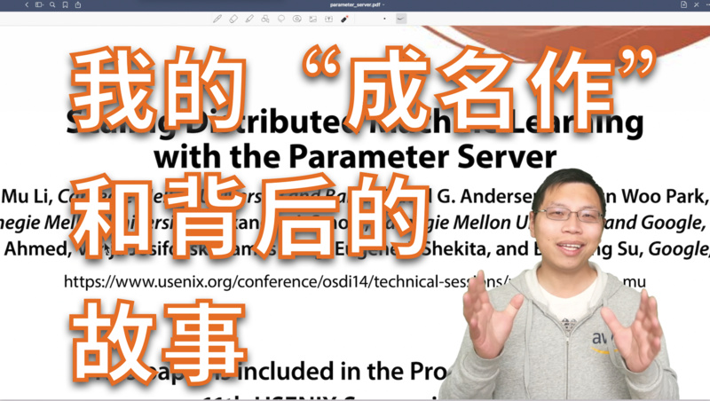 | 1:37:40 | [B站](https://www.bilibili.com/video/BV1YA4y197G8/)  |
| 4/14/22 | [视频理解论文串讲](https://arxiv.org/pdf/2012.06567.pdf)（上） | 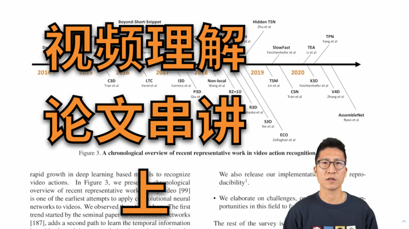 | 51:15 | [B站](https://www.bilibili.com/video/BV1fL4y157yA/) |
| 3/31/22 | [I3D](https://arxiv.org/pdf/1705.07750.pdf) 论文精读 | 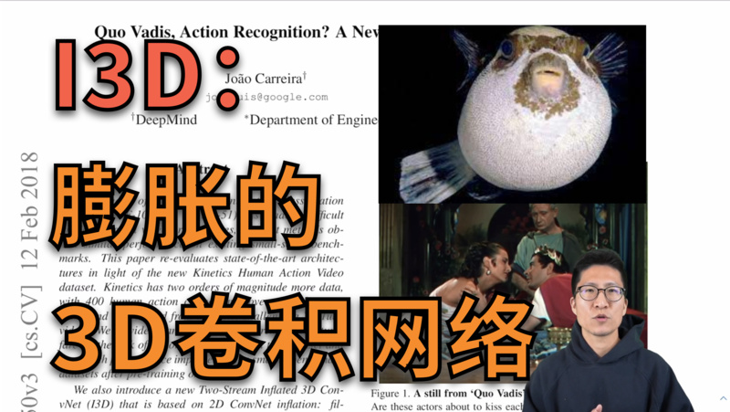 | 52:31 | [B站](https://www.bilibili.com/video/BV1tY4y1p7hq/), [YouTube](https://youtu.be/9lIkKiAn6uE) |
| 3/24/22 | 斯坦福 2022 年 [AI 指数报告](https://aiindex.stanford.edu/wp-content/uploads/2022/03/2022-AI-Index-Report_Master.pdf) 精读 | 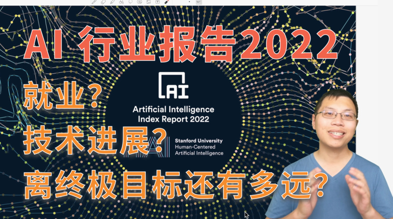 | 1:19:56 | [B站](https://www.bilibili.com/video/BV1s44y1N7eu/), [YouTube](https://youtu.be/K8h_xjQ6ufY) |
| 3/17/22 | [AlphaCode](https://storage.googleapis.com/deepmind-media/AlphaCode/competition_level_code_generation_with_alphacode.pdf) 论文精读 | 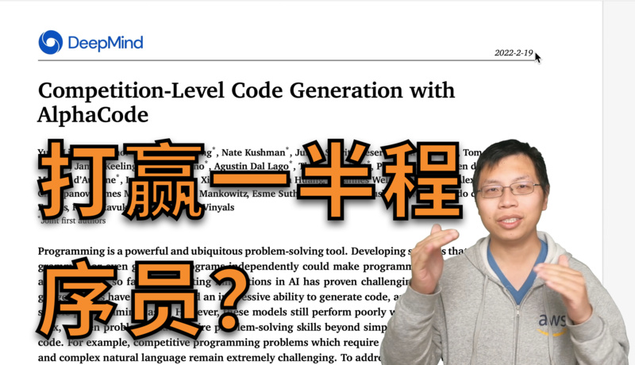 | 44:00 | [B站](https://www.bilibili.com/video/BV1ab4y1s7rc/), [YouTube](https://youtu.be/t8Gzkca9pW4) |
| 3/10/22 | [OpenAI Codex](https://arxiv.org/pdf/2107.03374.pdf) 论文精读 |  | 47:58 | [B站](https://www.bilibili.com/video/BV1iY41137Zi/), [知乎](https://www.zhihu.com/zvideo/1490959755963666432) [YouTube](https://youtu.be/oZriUGkQSNM) |
| 3/3/22 | [GPT](https://s3-us-west-2.amazonaws.com/openai-assets/research-covers/language-unsupervised/language_understanding_paper.pdf), [GPT-2](https://d4mucfpksywv.cloudfront.net/better-language-models/language_models_are_unsupervised_multitask_learners.pdf), [GPT-3](https://arxiv.org/abs/2005.14165) 精读 |  | 1:29:58 | [B站](https://www.bilibili.com/video/BV1AF411b7xQ/), [YouTube](https://youtu.be/t70Bl3w7bxY) |
| 2/24/22 | [Two-Stream](https://proceedings.neurips.cc/paper/2014/file/00ec53c4682d36f5c4359f4ae7bd7ba1-Paper.pdf) 逐段精读 |  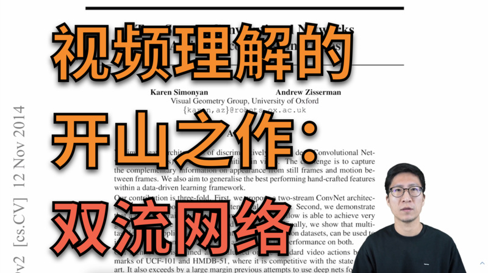 | 52:57 | [B站](https://www.bilibili.com/video/BV1mq4y1x7RU/), [YouTube](https://youtu.be/vuqwKP2iDe0) |
| 2/10/22 | [CLIP](https://openai.com/blog/clip/) 逐段精读 | 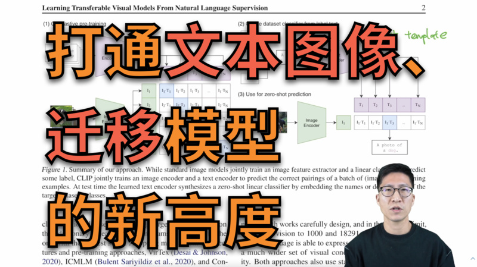 | 1:38:25 | [B站](https://www.bilibili.com/video/BV1SL4y1s7LQ/), [知乎](https://www.zhihu.com/zvideo/1475706654562299904), [YouTube](https://youtu.be/OZF1t_Hieq8) |
| 2/6/22 | 你（被）吐槽过[论文不够 novel](https://perceiving-systems.blog/en/post/novelty-in-science) 吗？|  | 14:11 | [B站](https://www.bilibili.com/video/BV1ea41127Bq/), [知乎](https://www.zhihu.com/zvideo/1475719090198876161) |
| 1/23/22 | [AlphaFold 2](https://www.nature.com/articles/s41586-021-03819-2.pdf) 精读 |  |  1:15:28 | [B站](https://www.bilibili.com/video/BV1oR4y1K7Xr/), [知乎](https://www.zhihu.com/zvideo/1469132410537717760), [YouTube](https://youtu.be/Oy3OCoGUr-w) |
| 1/18/22 | 如何判断（你自己的）研究工作的价值 |  |  9:59 | [B站](https://www.bilibili.com/video/BV1oL411c7Us/), [知乎](https://www.zhihu.com/zvideo/1475716940051869696) |
| 1/15/22 | [Swin Transformer](https://arxiv.org/pdf/2103.14030.pdf) 精读 | 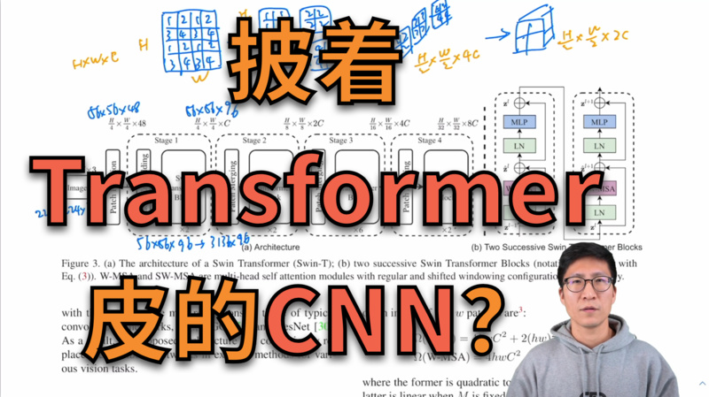 | 1:00:21 | [B站](https://www.bilibili.com/video/BV13L4y1475U/), [知乎](https://www.zhihu.com/zvideo/1466282983652691968), [YouTube](https://youtu.be/luP3-Fs0QCo) | 
| 1/7/22 | [指导数学直觉](https://www.nature.com/articles/s41586-021-04086-x.pdf) | 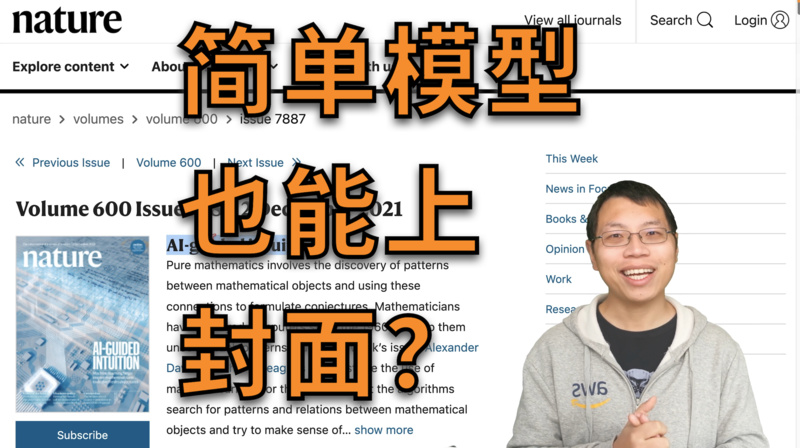 | 52:51 | [B站](https://www.bilibili.com/video/BV1YZ4y1S72j/), [知乎](https://www.zhihu.com/zvideo/1464060386375299072), [YouTube](https://youtu.be/czFGjvhtss8) | 
| 1/5/22 | AlphaFold 2 预告 | 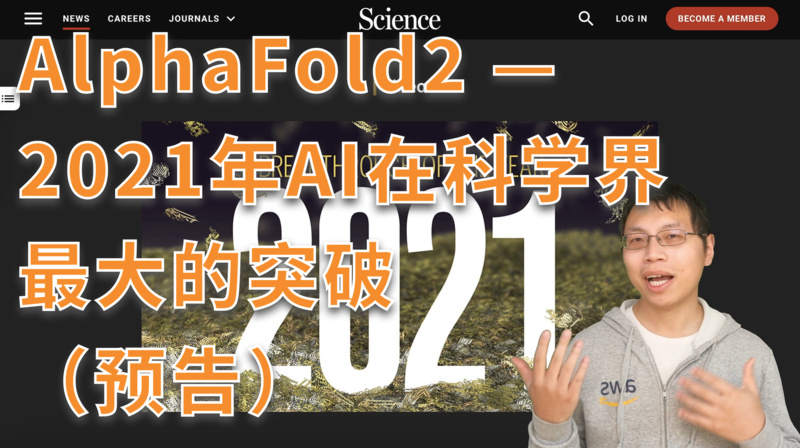 | 03:28 | [B站](https://www.bilibili.com/video/BV1Eu411U7Te/) | 
| 12/20/21 | [对比学习](#contrastive_learning)论文综述 | 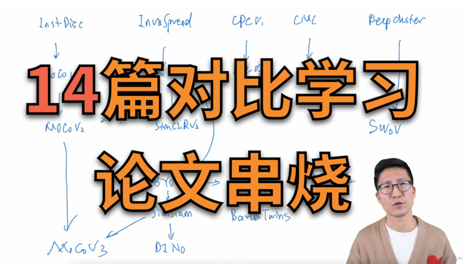 | 1:32:01 |[B站](https://www.bilibili.com/video/BV19S4y1M7hm/), [知乎](https://www.zhihu.com/zvideo/1460828005077164032), [YouTube](https://www.youtube.com/watch?v=1pvxufGRuW4)
| 12/15/21 | [MoCo](https://arxiv.org/pdf/1911.05722.pdf) 逐段精读 | 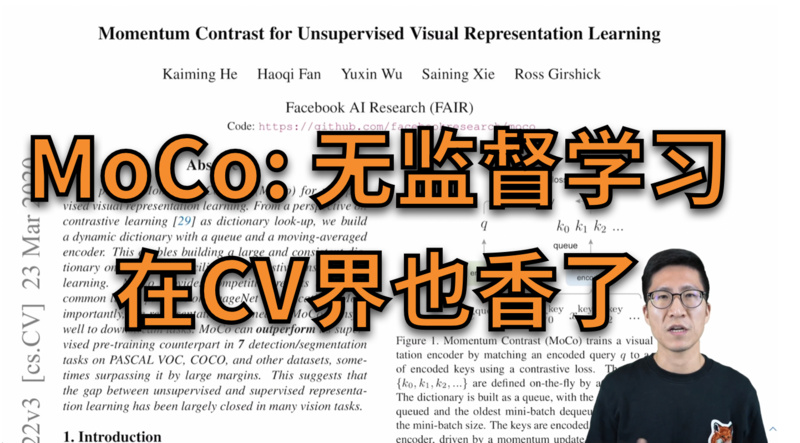 | 1:24:11 |  [B站](https://www.bilibili.com/video/BV1C3411s7t9/), [知乎](https://www.zhihu.com/zvideo/1454723120678936576), [YouTube](https://www.youtube.com/watch?v=1pvxufGRuW4) |
| 12/9/21 | 如何找研究想法 1 | 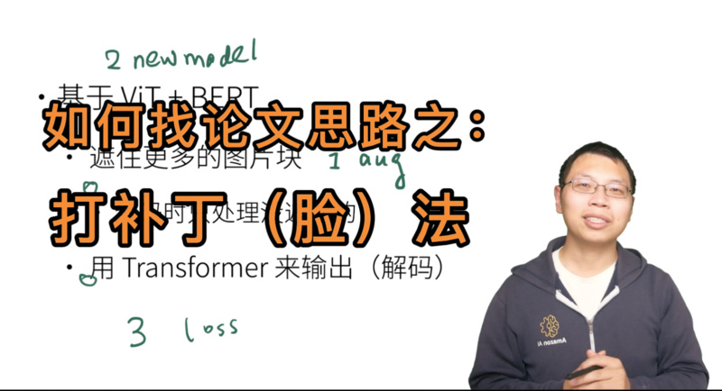 | 5:34 | [B站](https://www.bilibili.com/video/BV1qq4y1z7F2/) |
| 12/8/21 | [MAE](https://arxiv.org/pdf/2111.06377.pdf) 逐段精读 | 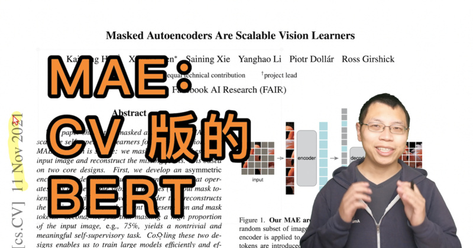 | 47:04 | [B站](https://www.bilibili.com/video/BV1sq4y1q77t), [知乎](https://www.zhihu.com/zvideo/1452458167968251904), [YouTube](https://youtu.be/mYlX2dpdHHM) |
| 11/29/21 | [ViT](https://arxiv.org/pdf/2010.11929.pdf) 逐段精读 | 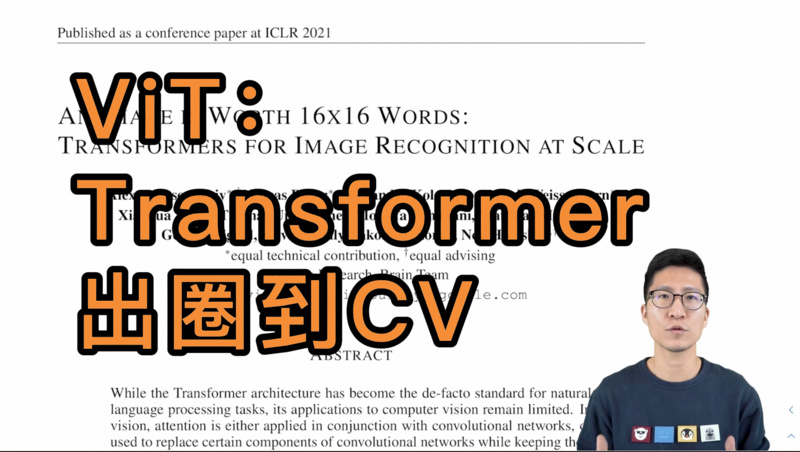 | 1:11:30 | [B站](https://www.bilibili.com/video/BV15P4y137jb/), [知乎](https://www.zhihu.com/zvideo/1449195245754380288), [YouTube](https://youtu.be/FRFt3x0bO94) |
| 11/18/21 | [BERT](https://arxiv.org/abs/1810.04805) 逐段精读 |  | 45:49  | [B站](https://www.bilibili.com/video/BV1PL411M7eQ), [知乎](https://www.zhihu.com/zvideo/1445340200976785408), [YouTube](https://youtu.be/ULD3uIb2MHQ) |
| 11/9/21 | [GAN](https://papers.nips.cc/paper/2014/file/5ca3e9b122f61f8f06494c97b1afccf3-Paper.pdf) 逐段精读 |  | 46:16  | [B站](https://www.bilibili.com/video/BV1rb4y187vD/), [知乎](https://www.zhihu.com/zvideo/1442091389241159681), [YouTube](https://www.youtube.com/watch?v=g_0HtlrLiDo) |
| 11/3/21 | 零基础多图详解 [图神经网络](https://distill.pub/2021/gnn-intro/)（GNN/GCN） |  | 1:06:19 | [B站](https://www.bilibili.com/video/BV1iT4y1d7zP/), [知乎](https://www.zhihu.com/zvideo/1439540657619087360), [YouTube](https://youtu.be/sejA2PtCITw) |
| 10/27/21 | [Transformer](https://arxiv.org/abs/1706.03762) 逐段精读  （视频中提到的文献 [^transformer]) | | 1:27:05 |[B站](https://www.bilibili.com/video/BV1pu411o7BE/), [知乎](https://www.zhihu.com/zvideo/1437034536677404672), [YouTube](https://youtu.be/nzqlFIcCSWQ)|
| 10/22/21 | [ResNet](https://arxiv.org/abs/1512.03385) 论文逐段精读 |  | 53:46 | [B站](https://www.bilibili.com/video/BV1P3411y7nn/), [知乎](https://www.zhihu.com/zvideo/1434795406001180672), [YouTube](https://www.youtube.com/watch?v=pWMnzCX4cwQ) |
| 10/21/21 | 撑起计算机视觉半边天的 [ResNet](https://arxiv.org/abs/1512.03385) |  | 11:50 | [B站](https://www.bilibili.com/video/BV1Fb4y1h73E/), [知乎](https://www.zhihu.com/zvideo/1434787226101751808), [YouTube](https://www.youtube.com/watch?v=NnSldWhSqvY) |
| 10/15/21 | [AlexNet](https://papers.nips.cc/paper/2012/file/c399862d3b9d6b76c8436e924a68c45b-Paper.pdf) 论文逐段精读 |  | 55:21 | [B站](https://www.bilibili.com/video/BV1hq4y157t1/), [知乎](https://www.zhihu.com/zvideo/1432354207483871232), [YouTube](https://www.youtube.com/watch?v=zjnxu8KUYKA) |
| 10/14/21 | 9年后重读深度学习奠基作之一：[AlexNet](https://papers.nips.cc/paper/2012/file/c399862d3b9d6b76c8436e924a68c45b-Paper.pdf) |  | 19:59 | [B站](https://www.bilibili.com/video/BV1ih411J7Kz/), [知乎](https://www.zhihu.com/zvideo/1432155856322920448), [YouTube](https://www.youtube.com/watch?v=vdYH0fE6thY) |
| 10/06/21 | 如何读论文 |  | 06:39 | [B站](https://www.bilibili.com/video/BV1H44y1t75x/), [知乎](https://www.zhihu.com/zvideo/1428973951632969728), [YouTube](https://www.youtube.com/watch?v=txjl_Q4jCyQ&list=PLFXJ6jwg0qW-7UM8iUTj3qKqdhbQULP5I&index=1) |

[^transformer]: 1 [斯坦福100+作者的200+页综述](https://arxiv.org/abs/2108.07258)，2 [对LayerNorm的新研究](https://arxiv.org/pdf/1911.07013.pdf)，3 [对Attention在Transformer里面作用的研究](https://arxiv.org/abs/2103.03404)

## 所有论文

包括已经录制完成和之后将要介绍的论文。选取的原则是10年内深度学习里有影响力文章（必读文章），或者近期比较有意思的文章。当然这十年里重要的工作太多了，不可能一一过一遍。在选取的时候我会偏向一些之前 [直播课](https://c.d2l.ai/zh-v2/) 中没讲到过的。 欢迎大家在 [讨论区](https://github.com/mli/paper-reading/discussions) 里提供建（点）议（歌）。

（这里引用采用的是 semanticscholar，是因为它提供 API 可以自动获取，不用手动更新。）

### 计算机视觉 - CNN

| 已录制 | 年份 | 名字                                                         | 简介                 | 引用                                                         |
| ------ | ---- | ------------------------------------------------------------ | -------------------- | -----------------------------------------------------------: |
| ✅      | 2012 | [AlexNet](https://papers.nips.cc/paper/2012/file/c399862d3b9d6b76c8436e924a68c45b-Paper.pdf) | 深度学习热潮的奠基作             | 73342 ([link](https://www.semanticscholar.org/paper/ImageNet-classification-with-deep-convolutional-Krizhevsky-Sutskever/abd1c342495432171beb7ca8fd9551ef13cbd0ff)) |
| | 2014 | [VGG](https://arxiv.org/pdf/1409.1556.pdf) | 使用 3x3 卷积构造更深的网络             | 55856 ([link](https://www.semanticscholar.org/paper/Very-Deep-Convolutional-Networks-for-Large-Scale-Simonyan-Zisserman/eb42cf88027de515750f230b23b1a057dc782108)) |
| | 2014 | [GoogleNet](https://arxiv.org/pdf/1409.4842.pdf) | 使用并行架构构造更深的网络             | 26878 ([link](https://www.semanticscholar.org/paper/Going-deeper-with-convolutions-Szegedy-Liu/e15cf50aa89fee8535703b9f9512fca5bfc43327)) |
|  ✅  | 2015 |  [ResNet](https://arxiv.org/pdf/1512.03385.pdf) | 构建深层网络都要有的残差连接。         | 80816 ([link](https://www.semanticscholar.org/paper/Deep-Residual-Learning-for-Image-Recognition-He-Zhang/2c03df8b48bf3fa39054345bafabfeff15bfd11d)) |
|  | 2017 | [MobileNet](https://arxiv.org/pdf/1704.04861.pdf) | 适合终端设备的小CNN             | 8695 ([link](https://www.semanticscholar.org/paper/MobileNets%3A-Efficient-Convolutional-Neural-Networks-Howard-Zhu/3647d6d0f151dc05626449ee09cc7bce55be497e)) |
| | 2019 | [EfficientNet](https://arxiv.org/pdf/1905.11946.pdf) | 通过架构搜索得到的CNN             | 3426 ([link](https://www.semanticscholar.org/paper/EfficientNet%3A-Rethinking-Model-Scaling-for-Neural-Tan-Le/4f2eda8077dc7a69bb2b4e0a1a086cf054adb3f9)) |
| | 2021 |  [Non-deep networks](https://arxiv.org/pdf/2110.07641.pdf) | 让不深的网络也能在ImageNet刷到SOTA             | 0 ([link](https://www.semanticscholar.org/paper/Non-deep-Networks-Goyal-Bochkovskiy/0d7f6086772079bc3e243b7b375a9ca1a517ba8b)) |

### 计算机视觉 - Transformer

| 已录制 | 年份 | 名字                                                         | 简介                 | 引用                                                         |
| ------ | ---- | ------------------------------------------------------------ | -------------------- | -----------------------------------------------------------: |
| ✅ | 2020 | [ViT](https://arxiv.org/pdf/2010.11929.pdf) | Transformer杀入CV界             | 1527 ([link](https://www.semanticscholar.org/paper/An-Image-is-Worth-16x16-Words%3A-Transformers-for-at-Dosovitskiy-Beyer/7b15fa1b8d413fbe14ef7a97f651f47f5aff3903)) |
| ✅ | 2021 |  [CLIP](https://openai.com/blog/clip/) | 图片和文本之间的对比学习             | 399 ([link](https://www.semanticscholar.org/paper/Learning-Transferable-Visual-Models-From-Natural-Radford-Kim/6f870f7f02a8c59c3e23f407f3ef00dd1dcf8fc4)) |
| ✅ | 2021 | [Swin Transformer](https://arxiv.org/pdf/2103.14030.pdf) | 多层次的Vision Transformer             | 384 ([link](https://www.semanticscholar.org/paper/Swin-Transformer%3A-Hierarchical-Vision-Transformer-Liu-Lin/c8b25fab5608c3e033d34b4483ec47e68ba109b7)) |
| | 2021 | [MLP-Mixer](https://arxiv.org/pdf/2105.01601.pdf) | 使用MLP替换self-attention      | 137 ([link](https://www.semanticscholar.org/paper/MLP-Mixer%3A-An-all-MLP-Architecture-for-Vision-Tolstikhin-Houlsby/2def61f556f9a5576ace08911496b7c7e4f970a4)) |
| ✅ | 2021 | [MAE](https://arxiv.org/pdf/2111.06377.pdf) | BERT的CV版       | 4 ([link](https://www.semanticscholar.org/paper/Masked-Autoencoders-Are-Scalable-Vision-Learners-He-Chen/c1962a8cf364595ed2838a097e9aa7cd159d3118)) |

### 计算机视觉 - GAN

| 已录制 | 年份 | 名字                                              | 简介         |                                                         引用 |
| ------ | ---- | ------------------------------------------------- | ------------ | -----------------------------------------------------------: |
|  ✅ | 2014 | [GAN](https://papers.nips.cc/paper/2014/file/5ca3e9b122f61f8f06494c97b1afccf3-Paper.pdf) | 生成模型的开创工作             | 26024 ([link](https://www.semanticscholar.org/paper/Generative-Adversarial-Nets-Goodfellow-Pouget-Abadie/54e325aee6b2d476bbbb88615ac15e251c6e8214)) |
|  | 2015 | [DCGAN](https://arxiv.org/pdf/1511.06434.pdf) | 使用CNN的GAN    | 9022 ([link](https://www.semanticscholar.org/paper/Unsupervised-Representation-Learning-with-Deep-Radford-Metz/8388f1be26329fa45e5807e968a641ce170ea078)) |
|  | 2016 | [pix2pix](https://arxiv.org/pdf/1611.07004.pdf) |     | 9752 ([link](https://www.semanticscholar.org/paper/Image-to-Image-Translation-with-Conditional-Isola-Zhu/8acbe90d5b852dadea7810345451a99608ee54c7)) |
|  | 2016 | [SRGAN](https://arxiv.org/pdf/1609.04802.pdf) | 图片超分辨率    | 5524 ([link](https://www.semanticscholar.org/paper/Photo-Realistic-Single-Image-Super-Resolution-Using-Ledig-Theis/df0c54fe61f0ffb9f0e36a17c2038d9a1964cba3)) |
|  | 2017 | [WGAN](https://arxiv.org/abs/1701.07875) | 训练更加容易    | 2620 ([link](https://www.semanticscholar.org/paper/Wasserstein-GAN-Arjovsky-Chintala/2f85b7376769473d2bed56f855f115e23d727094)) |
|  | 2017 | [CycleGAN](https://arxiv.org/abs/1703.10593) |     | 3401 ([link](https://www.semanticscholar.org/paper/Unpaired-Image-to-Image-Translation-Using-Networks-Zhu-Park/c43d954cf8133e6254499f3d68e45218067e4941)) |
|  | 2018 | [StyleGAN](https://arxiv.org/abs/1812.04948) |     | 2708 ([link](https://www.semanticscholar.org/paper/A-Style-Based-Generator-Architecture-for-Generative-Karras-Laine/ceb2ebef0b41e31c1a21b28c2734123900c005e2)) |
| | 2019 | [StyleGAN2](https://arxiv.org/pdf/1912.04958.pdf) |  | 1096 ([link](https://www.semanticscholar.org/paper/Analyzing-and-Improving-the-Image-Quality-of-Karras-Laine/f3e3d1f86a534a3654d0ee263142e44f4e2c61e9)) |
| | 2021 | [StyleGAN3](https://arxiv.org/pdf/2106.12423.pdf) |  | 23 ([link](https://www.semanticscholar.org/paper/Alias-Free-Generative-Adversarial-Networks-Karras-Aittala/c1ff08b59f00c44f34dfdde55cd53370733a2c19)) |

### 计算机视觉 - Object Detection

| 已录制 | 年份 | 名字                                              | 简介         |                                                         引用 |
| ------ | ---- | ------------------------------------------------- | ------------ | -----------------------------------------------------------: |
|        | 2014 | [R-CNN](https://arxiv.org/pdf/1311.2524v5.pdf)    | Two-stage       | 15545 ([link](https://www.semanticscholar.org/paper/2f4df08d9072fc2ac181b7fced6a245315ce05c8)) |
|        | 2015 | [Fast R-CNN](http://arxiv.org/abs/1504.08083v2)   |                 | 12578 ([link](https://www.semanticscholar.org/paper/7ffdbc358b63378f07311e883dddacc9faeeaf4b)) |
|        | 2015 | [Faster R-CNN](http://arxiv.org/abs/1506.01497v3) |                 | 28396 ([link](https://www.semanticscholar.org/paper/424561d8585ff8ebce7d5d07de8dbf7aae5e7270)) |
|        | 2016 | [SSD](http://arxiv.org/abs/1512.02325v5)          | Single stage    | 13449 ([link](https://www.semanticscholar.org/paper/4d7a9197433acbfb24ef0e9d0f33ed1699e4a5b0)) |
|        | 2016 | [YOLO](http://arxiv.org/abs/1506.02640v5)         |                 | 14099 ([link](https://www.semanticscholar.org/paper/f8e79ac0ea341056ef20f2616628b3e964764cfd)) |
|        | 2017 | [Mask R-CNN](http://arxiv.org/abs/1703.06870v3)   |                 | 3580 ([link](https://www.semanticscholar.org/paper/ea99a5535388196d0d44be5b4d7dd02029a43bb2)) |
|        | 2017 | [YOLOv2](http://arxiv.org/abs/1612.08242v1)       |                 | 6915 ([link](https://www.semanticscholar.org/paper/7d39d69b23424446f0400ef603b2e3e22d0309d6)) |
|        | 2018 | [YOLOv3](http://arxiv.org/abs/1804.02767v1)       |                 | 7002 ([link](https://www.semanticscholar.org/paper/e4845fb1e624965d4f036d7fd32e8dcdd2408148)) |
|        | 2019 | [CenterNet](https://arxiv.org/pdf/1904.07850.pdf) | Anchor free     | 773 ([link](https://www.semanticscholar.org/paper/Objects-as-Points-Zhou-Wang/6a2e2fd1b5bb11224daef98b3fb6d029f68a73f2)) |
|        | 2020 | [DETR](https://arxiv.org/pdf/2005.12872.pdf)      | Transformer     | 1053 ([link](https://www.semanticscholar.org/paper/End-to-End-Object-Detection-with-Transformers-Carion-Massa/962dc29fdc3fbdc5930a10aba114050b82fe5a3e)) |

### 计算机视觉 - 对比学习

| 已录制 | 年份 | 名字                                                         | 简介                 | 引用                                                         |
| ------ | ---- | ------------------------------------------------------------ | -------------------- | -----------------------------------------------------------: |
| ✅      | 2018 | [InstDisc](https://arxiv.org/pdf/1805.01978.pdf) | 提出实例判别和memory bank做对比学习            | 885 ([link](https://www.semanticscholar.org/paper/Unsupervised-Feature-Learning-via-Non-parametric-Wu-Xiong/155b7782dbd713982a4133df3aee7adfd0b6b304)) |
| ✅      | 2018 | [CPC](https://arxiv.org/pdf/1807.03748.pdf) | 对比预测编码，图像语音文本强化学习全都能做             | 2187 ([link](https://www.semanticscholar.org/paper/Representation-Learning-with-Contrastive-Predictive-Oord-Li/b227f3e4c0dc96e5ac5426b85485a70f2175a205)) |
| ✅      | 2019 | [InvaSpread](https://arxiv.org/pdf/1904.03436.pdf) | 一个编码器的端到端对比学习             | 223 ([link](https://www.semanticscholar.org/paper/Unsupervised-Embedding-Learning-via-Invariant-and-Ye-Zhang/e4bde6fe33b6c2cf9d1647ac0b041f7d1ba29c5b)) |
| ✅  | 2019 |  [CMC](https://arxiv.org/pdf/1906.05849.pdf) | 多视角下的对比学习         | 780 ([link](https://www.semanticscholar.org/paper/Contrastive-Multiview-Coding-Tian-Krishnan/97f4d09175705be4677d675fa27e55defac44800)) |
| ✅ | 2019 | [MoCov1](https://arxiv.org/pdf/1911.05722.pdf) | 无监督训练效果也很好             | 2011 ([link](https://www.semanticscholar.org/paper/Momentum-Contrast-for-Unsupervised-Visual-Learning-He-Fan/ec46830a4b275fd01d4de82bffcabe6da086128f)) |
|  ✅ | 2020 |  [SimCLRv1](https://arxiv.org/pdf/2002.05709.pdf) |  简单的对比学习 (数据增强 + MLP head + 大batch训练久)            | 2958 ([link](https://www.semanticscholar.org/paper/A-Simple-Framework-for-Contrastive-Learning-of-Chen-Kornblith/34733eaf66007516347a40ad5d9bbe1cc9dacb6b)) |
|  ✅ | 2020 | [MoCov2](https://arxiv.org/pdf/2003.04297.pdf) | MoCov1 + improvements from SimCLRv1             | 725 ([link](https://www.semanticscholar.org/paper/Improved-Baselines-with-Momentum-Contrastive-Chen-Fan/a1b8a8df281bbaec148a897927a49ea47ea31515)) |
|  ✅ | 2020 |  [SimCLRv2](https://arxiv.org/pdf/2006.10029.pdf) | 大的自监督预训练模型很适合做半监督学习             | 526 ([link](https://www.semanticscholar.org/paper/Big-Self-Supervised-Models-are-Strong-Learners-Chen-Kornblith/3e7f5f4382ac6f9c4fef6197dd21abf74456acd1)) |
| ✅  | 2020 |  [BYOL](https://arxiv.org/pdf/2006.07733.pdf) | 不需要负样本的对比学习             | 932 ([link](https://www.semanticscholar.org/paper/Bootstrap-Your-Own-Latent%3A-A-New-Approach-to-Grill-Strub/38f93092ece8eee9771e61c1edaf11b1293cae1b)) |
|  ✅ | 2020 |  [SWaV](https://arxiv.org/pdf/2006.09882.pdf) | 聚类对比学习             | 593 ([link](https://www.semanticscholar.org/paper/Unsupervised-Learning-of-Visual-Features-by-Cluster-Caron-Misra/10161d83d29fc968c4612c9e9e2b61a2fc25842e)) |
|  ✅ | 2020 |  [SimSiam](https://arxiv.org/pdf/2011.10566.pdf) | 化繁为简的孪生表征学习             | 403 ([link](https://www.semanticscholar.org/paper/Exploring-Simple-Siamese-Representation-Learning-Chen-He/0e23d2f14e7e56e81538f4a63e11689d8ac1eb9d)) |
| ✅ | 2021 | [MoCov3](https://arxiv.org/pdf/2104.02057.pdf) | 如何更稳定的自监督训练ViT             | 96 ([link](https://www.semanticscholar.org/paper/An-Empirical-Study-of-Training-Self-Supervised-Chen-Xie/739ceacfafb1c4eaa17509351b647c773270b3ae)) |
|  ✅ | 2021 |  [DINO](https://arxiv.org/pdf/2104.14294.pdf) | transformer加自监督在视觉也很香             | 200 ([link](https://www.semanticscholar.org/paper/Emerging-Properties-in-Self-Supervised-Vision-Caron-Touvron/ad4a0938c48e61b7827869e4ac3baffd0aefab35)) |

### 自然语言处理 - Transformer

| 已录制 | 年份 | 名字                                                         | 简介                 | 引用                                                         |
| ------ | ---- | ------------------------------------------------------------ | -------------------- | -----------------------------------------------------------: |
| ✅ | 2017 | [Transformer](https://arxiv.org/abs/1706.03762) | 继MLP、CNN、RNN后的第四大类架构             | 26029 ([link](https://www.semanticscholar.org/paper/Attention-is-All-you-Need-Vaswani-Shazeer/204e3073870fae3d05bcbc2f6a8e263d9b72e776)) |
| ✅ | 2018 | [GPT](https://s3-us-west-2.amazonaws.com/openai-assets/research-covers/language-unsupervised/language_understanding_paper.pdf) | 使用 Transformer 解码器来做预训练         | 2752 ([link](https://www.semanticscholar.org/paper/Improving-Language-Understanding-by-Generative-Radford-Narasimhan/cd18800a0fe0b668a1cc19f2ec95b5003d0a5035)) |
| ✅ | 2018 | [BERT](https://arxiv.org/abs/1810.04805) | Transformer一统NLP的开始            | 25340 ([link](https://www.semanticscholar.org/paper/BERT%3A-Pre-training-of-Deep-Bidirectional-for-Devlin-Chang/df2b0e26d0599ce3e70df8a9da02e51594e0e992)) |
| ✅ | 2019 | [GPT-2](https://d4mucfpksywv.cloudfront.net/better-language-models/language_models_are_unsupervised_multitask_learners.pdf)  |  更大的 GPT 模型，朝着zero-shot learning迈了一大步       | 4534 ([link](https://www.semanticscholar.org/paper/Language-Models-are-Unsupervised-Multitask-Learners-Radford-Wu/9405cc0d6169988371b2755e573cc28650d14dfe)) |
| ✅ | 2020 |  [GPT-3](https://arxiv.org/abs/2005.14165) | 100倍更大的 GPT-2，few-shot learning效果显著            | 2548 ([link](https://www.semanticscholar.org/paper/Language-Models-are-Few-Shot-Learners-Brown-Mann/6b85b63579a916f705a8e10a49bd8d849d91b1fc)) |

### 图神经网络

| 已录制 | 年份 | 名字                                                         | 简介                 | 引用                                                         |
| ------ | ---- | ------------------------------------------------------------ | -------------------- | -----------------------------------------------------------: |
|  ✅ |  2021 | [图神经网络介绍](https://distill.pub/2021/gnn-intro/) | GNN的可视化介绍            | 4 ([link](https://www.semanticscholar.org/paper/A-Gentle-Introduction-to-Graph-Neural-Networks-S%C3%A1nchez-Lengeling-Reif/2c0e0440882a42be752268d0b64243243d752a74)) |

### 优化算法

| 已录制 | 年份 | 名字                                                         | 简介                 | 引用                                                         |
| ------ | ---- | ------------------------------------------------------------ | -------------------- | -----------------------------------------------------------: |
| | 2014 | [Adam](https://arxiv.org/abs/1412.6980) | 深度学习里最常用的优化算法之一             | 77401 ([link](https://www.semanticscholar.org/paper/Adam%3A-A-Method-for-Stochastic-Optimization-Kingma-Ba/a6cb366736791bcccc5c8639de5a8f9636bf87e8)) |
| | 2016 |  [为什么超大的模型泛化性不错](https://arxiv.org/abs/1611.03530)   |         | 3112 ([link](https://www.semanticscholar.org/paper/Understanding-deep-learning-requires-rethinking-Zhang-Bengio/54ddb00fa691728944fd8becea90a373d21597cf)) |
| | 2017 | [为什么Momentum有效](https://distill.pub/2017/momentum/) | Distill的可视化介绍      | 116 ([link](https://www.semanticscholar.org/paper/Why-Momentum-Really-Works-Goh/3e8ccf9d3d843c9855c5d76ab66d3e775384da72)) |

### 新领域应用

| 已录制 | 年份 | 名字                                                         | 简介                 | 引用                                                         |
| ------ | ---- | ------------------------------------------------------------ | -------------------- | -----------------------------------------------------------: |
| | 2016 | [AlphaGo](https://storage.googleapis.com/deepmind-media/alphago/AlphaGoNaturePaper.pdf) | 强化学习出圈           | 10257 ([link](https://www.semanticscholar.org/paper/Mastering-the-game-of-Go-with-deep-neural-networks-Silver-Huang/846aedd869a00c09b40f1f1f35673cb22bc87490)) |
| | 2020 | [AlphaFold](https://discovery.ucl.ac.uk/id/eprint/10089234/1/343019_3_art_0_py4t4l_convrt.pdf) | 赢得比赛的的蛋白质3D结构预测 | 1074（[link](https://www.semanticscholar.org/paper/Improved-protein-structure-prediction-using-from-Senior-Evans/3a083d843f891b3574494c385699c21766ce8b7a)) |
| ✅ | 2021 | [AlphaFold 2](https://www.nature.com/articles/s41586-021-03819-2.pdf) | 原子级别精度的蛋白质3D结构预测 | 921 ([link](https://www.semanticscholar.org/paper/Highly-accurate-protein-structure-prediction-with-Jumper-Evans/dc32a984b651256a8ec282be52310e6bd33d9815))|
| ✅ | 2021 | [Codex](https://arxiv.org/pdf/2107.03374.pdf) | 使用注释生成代码 | 92 ([link](https://www.semanticscholar.org/paper/Evaluating-Large-Language-Models-Trained-on-Code-Chen-Tworek/acbdbf49f9bc3f151b93d9ca9a06009f4f6eb269))|
| ✅ | 2021 | [指导数学直觉](https://www.nature.com/articles/s41586-021-04086-x.pdf) | 分析不同数学物体之前的联系来帮助发现新定理   | 4 ([link](https://www.semanticscholar.org/paper/Advancing-mathematics-by-guiding-human-intuition-AI-Davies-Velickovic/f672b8fb430606fee0bb368f16603531ce1e90c4)) |
| ✅ | 2022 | [AlphaCode](https://storage.googleapis.com/deepmind-media/AlphaCode/competition_level_code_generation_with_alphacode.pdf) | 媲美一般程序员的编程解题水平 | 2 ([link](https://www.semanticscholar.org/paper/Competition-Level-Code-Generation-with-AlphaCode-Li-Choi/5cbe278b65a81602a864184bbca37de91448a5f5)) | 

