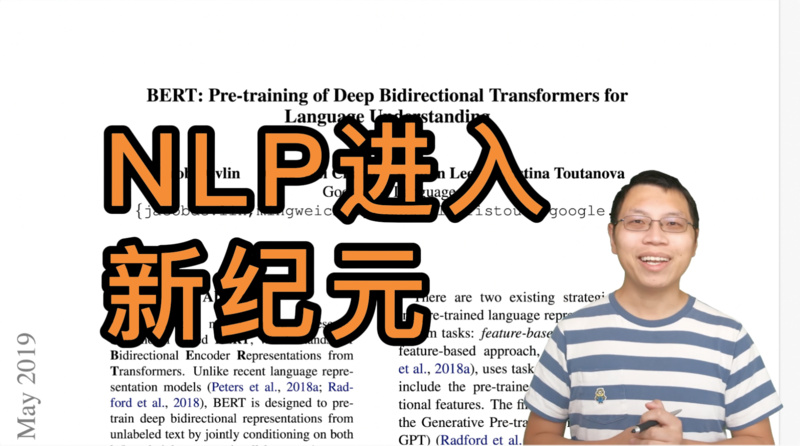
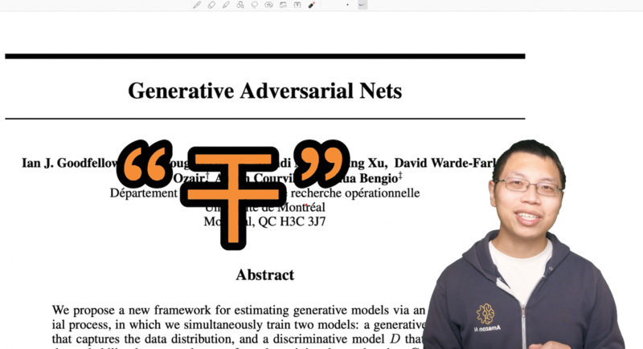
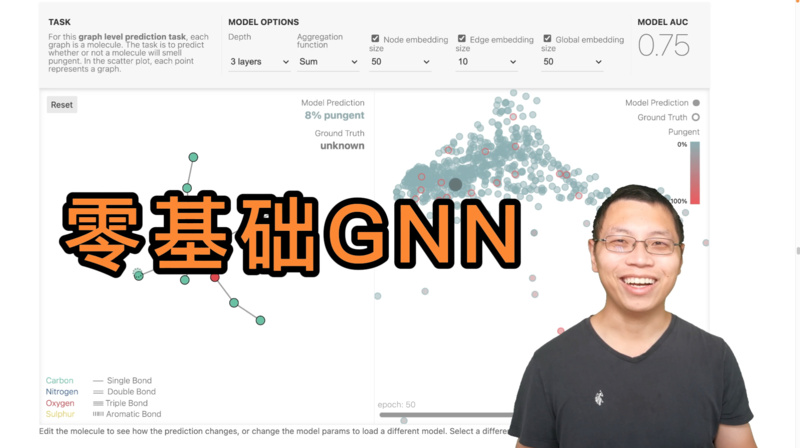
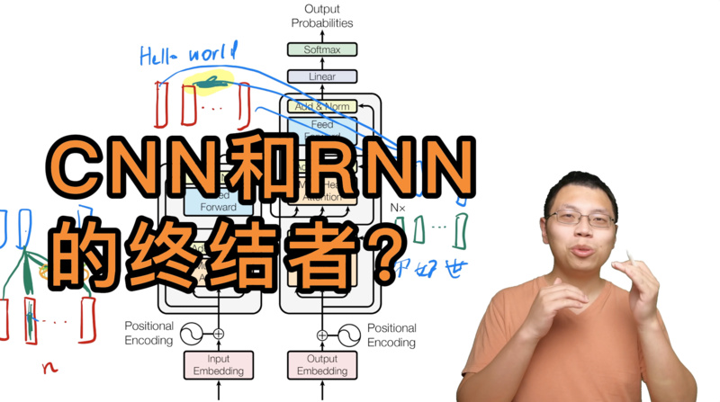
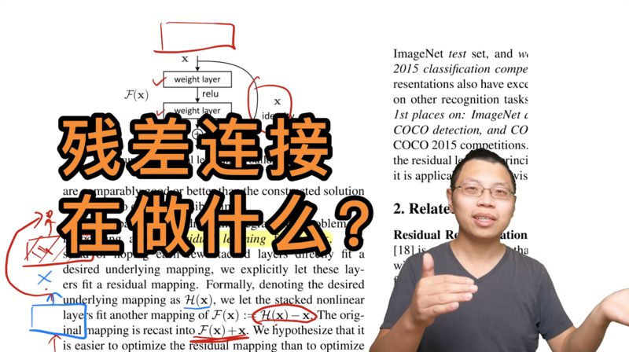
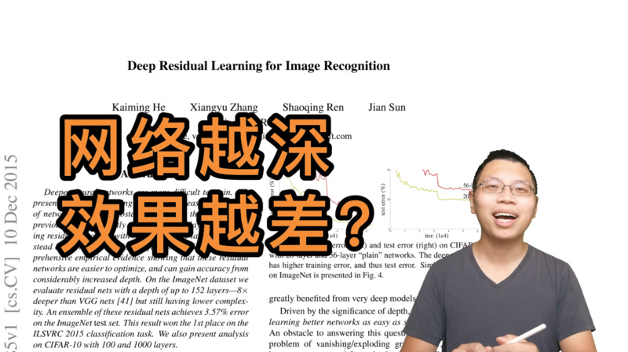
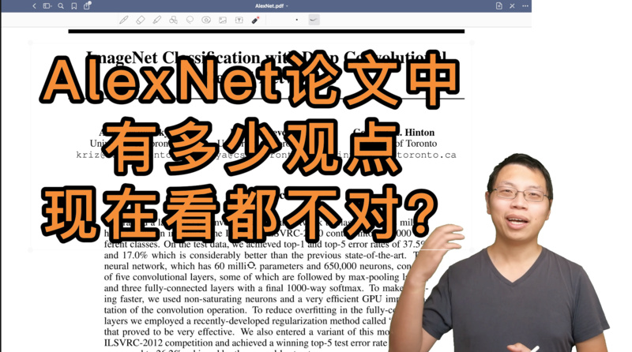
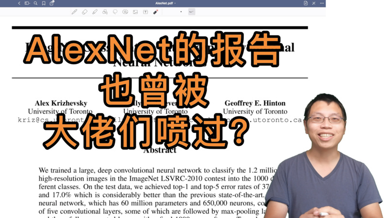

# 深度学习论文精读

## 录制完成的论文

| 日期 | 标题 | 封面 | 时长 | 视频（4K） |
| -- | -- | -- | -- | -- |
| 11/18/21 | [BERT](https://arxiv.org/abs/1810.04805) 逐段精读 |  | 45:49  | [B站](https://www.bilibili.com/video/BV1PL411M7eQ), [知乎](https://www.zhihu.com/zvideo/1445340200976785408), [YouTube](https://youtu.be/ULD3uIb2MHQ) |
| 11/9/21 | [GAN](https://papers.nips.cc/paper/2014/file/5ca3e9b122f61f8f06494c97b1afccf3-Paper.pdf) 逐段精读 |  | 46:16  | [B站](https://www.bilibili.com/video/BV1rb4y187vD/), [知乎](https://www.zhihu.com/zvideo/1442091389241159681), [YouTube](https://www.youtube.com/watch?v=g_0HtlrLiDo) |
| 11/3/21 | 零基础多图详解 [图神经网络](https://distill.pub/2021/gnn-intro/)（GNN/GCN） |  | 66:19 | [B站](https://www.bilibili.com/video/BV1iT4y1d7zP/), [知乎](https://www.zhihu.com/zvideo/1439540657619087360), [YouTube](https://youtu.be/sejA2PtCITw) |
| 10/27/21 | [Transformer](https://arxiv.org/abs/1706.03762) 逐段精读  （视频中提到的文献 [^transformer]) | | 87:05 |[B站](https://www.bilibili.com/video/BV1pu411o7BE/), [知乎](https://www.zhihu.com/zvideo/1437034536677404672), [YouTube](https://youtu.be/nzqlFIcCSWQ)|
| 10/22/21 | [ResNet](https://arxiv.org/abs/1512.03385) 论文逐段精读 |  | 53:46 | [B站](https://www.bilibili.com/video/BV1P3411y7nn/), [知乎](https://www.zhihu.com/zvideo/1434795406001180672), [YouTube](https://www.youtube.com/watch?v=pWMnzCX4cwQ) |
| 10/21/21 | 撑起计算机视觉半边天的 [ResNet](https://arxiv.org/abs/1512.03385) |  | 11:50 | [B站](https://www.bilibili.com/video/BV1Fb4y1h73E/), [知乎](https://www.zhihu.com/zvideo/1434787226101751808), [YouTube](https://www.youtube.com/watch?v=NnSldWhSqvY) |
| 10/15/21 | [AlexNet](https://papers.nips.cc/paper/2012/file/c399862d3b9d6b76c8436e924a68c45b-Paper.pdf) 论文逐段精读 |  | 55:21 | [B站](https://www.bilibili.com/video/BV1hq4y157t1/), [知乎](https://www.zhihu.com/zvideo/1432354207483871232), [YouTube](https://www.youtube.com/watch?v=zjnxu8KUYKA) |
| 10/14/21 | 9年后重读深度学习奠基作之一：[AlexNet](https://papers.nips.cc/paper/2012/file/c399862d3b9d6b76c8436e924a68c45b-Paper.pdf) |  | 19:59 | [B站](https://www.bilibili.com/video/BV1ih411J7Kz/), [知乎](https://www.zhihu.com/zvideo/1432155856322920448), [YouTube](https://www.youtube.com/watch?v=vdYH0fE6thY) |
| 10/06/21 | 如何读论文 |  | 06:39 | [B站](https://www.bilibili.com/video/BV1H44y1t75x/), [知乎](https://www.zhihu.com/zvideo/1428973951632969728), [YouTube](https://www.youtube.com/watch?v=txjl_Q4jCyQ&list=PLFXJ6jwg0qW-7UM8iUTj3qKqdhbQULP5I&index=1) |

[^transformer]: 1 [斯坦福100+作者的200+页综述](https://arxiv.org/abs/2108.07258)，2 [对LayerNorm的新研究](https://arxiv.org/pdf/1911.07013.pdf)，3 [对Attention在Transformer里面作用的研究](https://arxiv.org/abs/2103.03404)

## 所有论文

包括已经录制完成和之后将要介绍的论文。选取的原则是10年内深度学习里有影响力文章（必读文章），或者近期比较有意思的文章。当然这十年里重要的工作太多了，不可能一一过一遍。在选取的时候我会偏向一些之前 [直播课](https://c.d2l.ai/zh-v2/) 中没讲到过的。 欢迎大家在 [讨论区](https://github.com/mli/paper-reading/discussions) 里提供建（点）议（歌）。

（这里引用采用的是 semanticscholar，是因为它提供 API 可以自动获取，不用手动更新。）

### 计算机视觉 - CNN

| 已录制 | 年份 | 名字                                                         | 简介                 | 引用                                                         |
| ------ | ---- | ------------------------------------------------------------ | -------------------- | ------------------------------------------------------------ |
| ✅      | 2012 | [AlexNet](https://papers.nips.cc/paper/2012/file/c399862d3b9d6b76c8436e924a68c45b-Paper.pdf) | 深度学习热潮的奠基作        | >=10K ([link](https://www.semanticscholar.org/paper/ImageNet-classification-with-deep-convolutional-Krizhevsky-Sutskever/abd1c342495432171beb7ca8fd9551ef13cbd0ff)) |
|  ✅ | 2014 | [GAN](https://papers.nips.cc/paper/2014/file/5ca3e9b122f61f8f06494c97b1afccf3-Paper.pdf) | 生成模型的开创工作        | 9998 ([link](https://www.semanticscholar.org/paper/Generative-Adversarial-Nets-Goodfellow-Pouget-Abadie/54e325aee6b2d476bbbb88615ac15e251c6e8214)) |
| | 2014 | [VGG](https://arxiv.org/pdf/1409.1556.pdf) | 使用 3x3 卷积构造更深的网络        | >=10K ([link](https://www.semanticscholar.org/paper/Very-Deep-Convolutional-Networks-for-Large-Scale-Simonyan-Zisserman/eb42cf88027de515750f230b23b1a057dc782108)) |
| | 2014 | [GoogleNet](https://arxiv.org/pdf/1409.4842.pdf) | 使用并行架构构造更深的网络        | 9997 ([link](https://www.semanticscholar.org/paper/Going-deeper-with-convolutions-Szegedy-Liu/e15cf50aa89fee8535703b9f9512fca5bfc43327)) |
|  ✅  | 2015 |  [ResNet](https://arxiv.org/pdf/1512.03385.pdf) | 构建深层网络都要有的残差连接。    | >=10K ([link](https://www.semanticscholar.org/paper/Deep-Residual-Learning-for-Image-Recognition-He-Zhang/2c03df8b48bf3fa39054345bafabfeff15bfd11d)) |
|  | 2017 | [MobileNet](https://arxiv.org/pdf/1704.04861.pdf) | 适合终端设备的小CNN        | 8687 ([link](https://www.semanticscholar.org/paper/MobileNets%3A-Efficient-Convolutional-Neural-Networks-Howard-Zhu/3647d6d0f151dc05626449ee09cc7bce55be497e)) |
| | 2019 | [EfficientNet](https://arxiv.org/pdf/1905.11946.pdf) | 通过架构搜索得到的CNN        | 3423 ([link](https://www.semanticscholar.org/paper/EfficientNet%3A-Rethinking-Model-Scaling-for-Neural-Tan-Le/4f2eda8077dc7a69bb2b4e0a1a086cf054adb3f9)) |
| | 2019 | [MoCo](https://arxiv.org/pdf/1911.05722.pdf) | 无监督训练效果也很好        | 2008 ([link](https://www.semanticscholar.org/paper/Momentum-Contrast-for-Unsupervised-Visual-Learning-He-Fan/ec46830a4b275fd01d4de82bffcabe6da086128f)) |
| | 2021 |  [Non-deep networks](https://arxiv.org/pdf/2110.07641.pdf) | 让不深的网络也能在ImageNet刷到SOTA        | 0 ([link](https://www.semanticscholar.org/paper/Non-deep-Networks-Goyal-Bochkovskiy/0d7f6086772079bc3e243b7b375a9ca1a517ba8b)) |

### 计算机视觉 - Transformer

| 已录制 | 年份 | 名字                                                         | 简介                 | 引用                                                         |
| ------ | ---- | ------------------------------------------------------------ | -------------------- | ------------------------------------------------------------ |
| | 2020 | [ViT](https://arxiv.org/pdf/2010.11929.pdf) | Transformer杀入CV界        | 1525 ([link](https://www.semanticscholar.org/paper/An-Image-is-Worth-16x16-Words%3A-Transformers-for-at-Dosovitskiy-Beyer/7b15fa1b8d413fbe14ef7a97f651f47f5aff3903)) |
| | 2021 |  [CLIP](https://openai.com/blog/clip/) | 图片和文本之间的对比学习        | 399 ([link](https://www.semanticscholar.org/paper/Learning-Transferable-Visual-Models-From-Natural-Radford-Kim/6f870f7f02a8c59c3e23f407f3ef00dd1dcf8fc4)) |
| | 2021 | [Swin Transformer](https://arxiv.org/pdf/2103.14030.pdf) | 多层次的Vision Transformer        | 383 ([link](https://www.semanticscholar.org/paper/Swin-Transformer%3A-Hierarchical-Vision-Transformer-Liu-Lin/c8b25fab5608c3e033d34b4483ec47e68ba109b7)) |
| | 2021 | [MLP-Mixer](https://arxiv.org/pdf/2105.01601.pdf) | 使用MLP替换self-attention | 136 ([link](https://www.semanticscholar.org/paper/MLP-Mixer%3A-An-all-MLP-Architecture-for-Vision-Tolstikhin-Houlsby/2def61f556f9a5576ace08911496b7c7e4f970a4)) |
| | 2021 | [MAE](https://arxiv.org/pdf/2111.06377.pdf) | BERT的CV版  | 4 ([link](https://www.semanticscholar.org/paper/Masked-Autoencoders-Are-Scalable-Vision-Learners-He-Chen/c1962a8cf364595ed2838a097e9aa7cd159d3118)) |

### 自然语言处理 - Transformer

| 已录制 | 年份 | 名字                                                         | 简介                 | 引用                                                         |
| ------ | ---- | ------------------------------------------------------------ | -------------------- | ------------------------------------------------------------ |
| ✅ | 2017 | [Transformer](https://arxiv.org/abs/1706.03762) | 继MLP、CNN、RNN后的第四大类架构        | >=10K ([link](https://www.semanticscholar.org/paper/Attention-is-All-you-Need-Vaswani-Shazeer/204e3073870fae3d05bcbc2f6a8e263d9b72e776)) |
| | 2018 | [GPT](https://s3-us-west-2.amazonaws.com/openai-assets/research-covers/language-unsupervised/language_understanding_paper.pdf) | 使用 Transformer 来做预训练    | 2749 ([link](https://www.semanticscholar.org/paper/Improving-Language-Understanding-by-Generative-Radford-Narasimhan/cd18800a0fe0b668a1cc19f2ec95b5003d0a5035)) |
| ✅ | 2018 | [BERT](https://arxiv.org/abs/1810.04805) | Transformer一统NLP的开始       | >=10K ([link](https://www.semanticscholar.org/paper/BERT%3A-Pre-training-of-Deep-Bidirectional-for-Devlin-Chang/df2b0e26d0599ce3e70df8a9da02e51594e0e992)) |
|  | 2019 | [GPT-2](https://d4mucfpksywv.cloudfront.net/better-language-models/language_models_are_unsupervised_multitask_learners.pdf)  |    | 4533 ([link](https://www.semanticscholar.org/paper/Language-Models-are-Unsupervised-Multitask-Learners-Radford-Wu/9405cc0d6169988371b2755e573cc28650d14dfe)) |
|  | 2020 |  [GPT-3](https://arxiv.org/abs/2005.14165) | 朝着zero-shot learning迈了一大步       | 2545 ([link](https://www.semanticscholar.org/paper/Language-Models-are-Few-Shot-Learners-Brown-Mann/6b85b63579a916f705a8e10a49bd8d849d91b1fc)) |

### 通用技术

| 已录制 | 年份 | 名字                                                         | 简介                 | 引用                                                         |
| ------ | ---- | ------------------------------------------------------------ | -------------------- | ------------------------------------------------------------ |
| | 2014 | [Adam](https://arxiv.org/abs/1412.6980) | 深度学习里最常用的优化算法之一        | >=10K ([link](https://www.semanticscholar.org/paper/Adam%3A-A-Method-for-Stochastic-Optimization-Kingma-Ba/a6cb366736791bcccc5c8639de5a8f9636bf87e8)) |
| | 2016 |  [为什么超大的模型泛化性不错](https://arxiv.org/abs/1611.03530)   |    | 3109 ([link](https://www.semanticscholar.org/paper/Understanding-deep-learning-requires-rethinking-Zhang-Bengio/54ddb00fa691728944fd8becea90a373d21597cf)) |

### 其他领域

| 已录制 | 年份 | 名字                                                         | 简介                 | 引用                                                         |
| ------ | ---- | ------------------------------------------------------------ | -------------------- | ------------------------------------------------------------ |
|  | 2014 | [Two-stream networks](https://arxiv.org/abs/1406.2199) | 首次超越手工特征的视频分类架构        | 5093 ([link](https://www.semanticscholar.org/paper/Two-Stream-Convolutional-Networks-for-Action-in-Simonyan-Zisserman/67dccc9a856b60bdc4d058d83657a089b8ad4486)) |
| | 2016 | [AlphaGo](https://storage.googleapis.com/deepmind-media/alphago/AlphaGoNaturePaper.pdf) | 强化学习出圈      | 9998 ([link](https://www.semanticscholar.org/paper/Mastering-the-game-of-Go-with-deep-neural-networks-Silver-Huang/846aedd869a00c09b40f1f1f35673cb22bc87490)) |
|  ✅ |  2021 | [图神经网络介绍](https://distill.pub/2021/gnn-intro/) | GNN的可视化介绍       | 4 ([link](https://www.semanticscholar.org/paper/A-Gentle-Introduction-to-Graph-Neural-Networks-S%C3%A1nchez-Lengeling-Reif/2c0e0440882a42be752268d0b64243243d752a74)) |

TODO：

1. Out-of-distribution
1. AlphaFold
1. Anchor-free object detection
1. Knowledge graph
